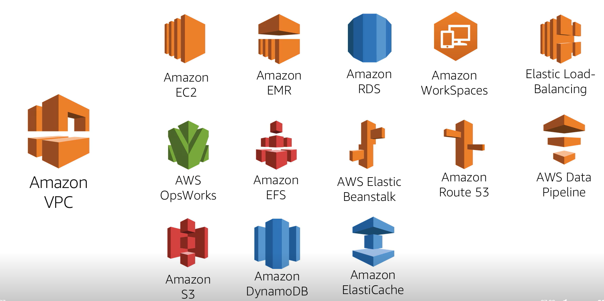
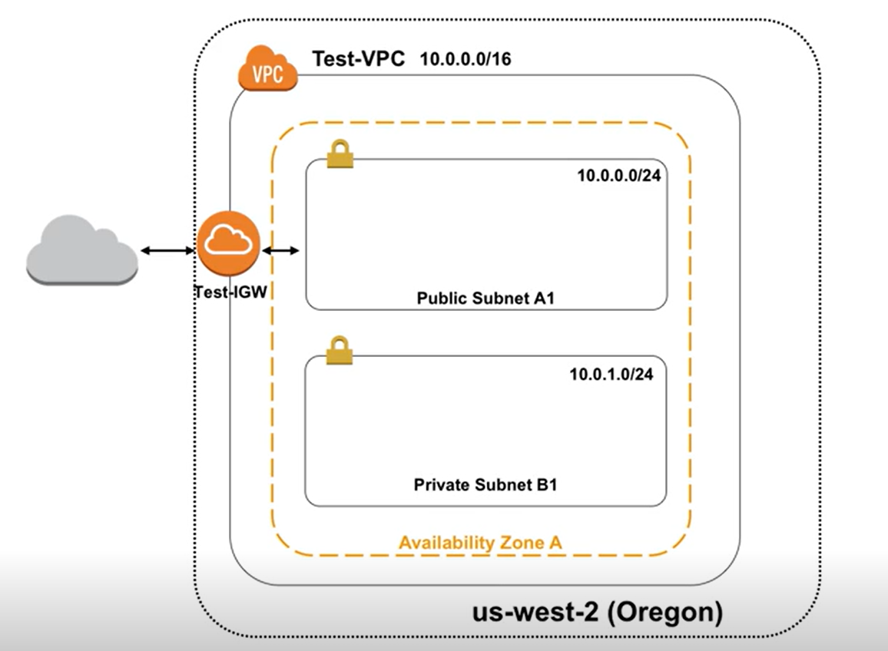
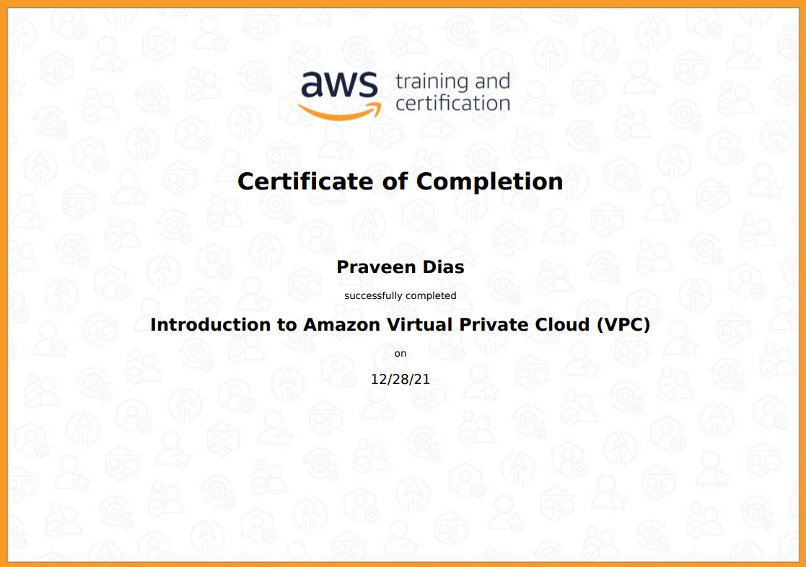

# Amazon VPC

## Virtual Private Cloud

Logically Isolated Virtual Private Cloud

https://aws.amazon.com/vpc/

A private, virtual network in the AWS cloud
- uses same concepts as on premise networking

# Example VPC

# Training Completed

